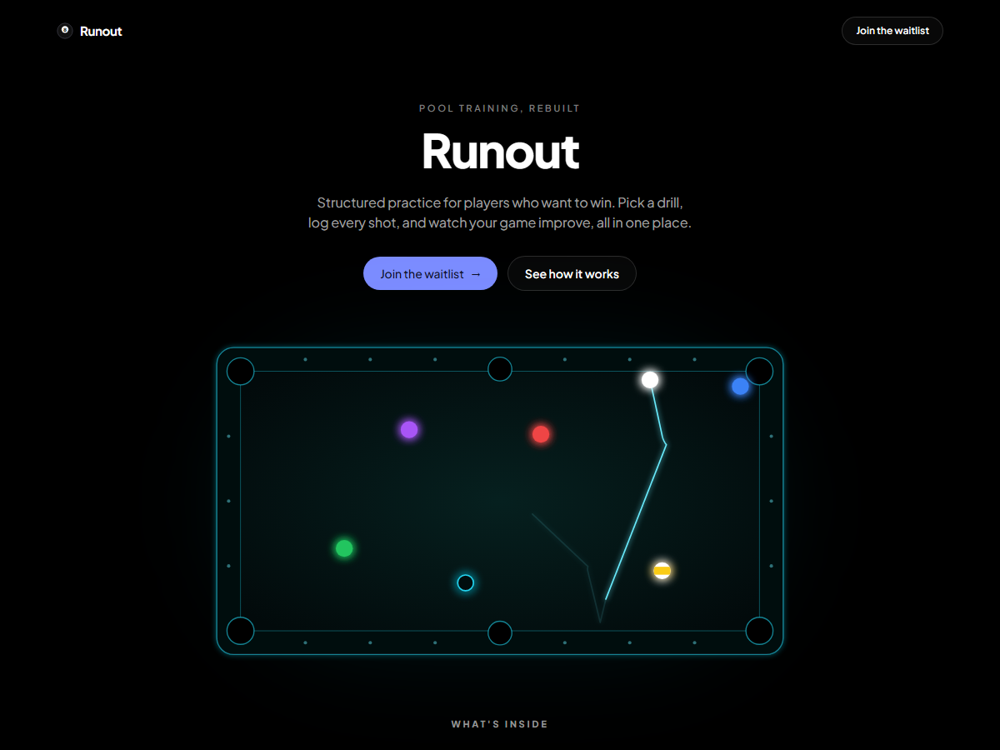

# Runout

A "coming soon" landing page for **Runout**, a pool training app. The planned app has a drill library, shot logging, and progress tracking.

**Live demo:** https://leggiardo-code.github.io/runout/

## Status

This is an early landing page. The app itself isn't built yet. The "Join the waitlist" buttons are placeholders and don't collect anything yet.

## What's notable

The page has an animated nine-ball break-and-run on a pool table. The cue ball's motion is computed from real pool physics, not hand-drawn curves:

- **90-degree rule:** after a cut shot, the object ball leaves along the line of centers and the cue ball leaves along the tangent line.
- **Natural-roll curve:** the cue ball's topspin bends its path forward after contact.
- **Skid, then roll:** a struck ball skids under sliding friction until it is rolling, then coasts to a stop under rolling friction.
- **Mirror-angle rails:** the angle in equals the angle out, and each cushion takes some speed off the ball.

The physics follows the work of [Dr. Dave Alciatore](https://billiards.colostate.edu), whose pool physics research and resources are the reference.

A few honest notes on scope: the paths are calculated ahead of time and the page plays them back, so it isn't a live physics engine. The break itself is choreographed (it follows the same friction and rail rules, but the layout isn't simulated from scratch). Playback is a 3x time-lapse of the real-time physics.

## How it was built

It's a single `index.html` file using Tailwind CSS (via CDN) and inline SVG. No build step, no dependencies to install.

I designed the page and checked the physics as a pool player. [Claude Code](https://claude.com/claude-code) wrote the code.

## How to view it

1. Download this repo (green **Code** button, then **Download ZIP**) or clone it.
2. Open `index.html` in a browser.

It needs an internet connection, because Tailwind and the Plus Jakarta Sans font load from CDNs.

Tip: add `?t=5000` to the page address to freeze the animation at 5000 ms (this is how the screenshot above was taken).

## About

Built by Tyrone Leggiardo, founder of [WhiteStone Operations](https://whitestoneoperations.io). I work in operations, CRM, and automation, and I'm learning to build with Python and Claude Code.
